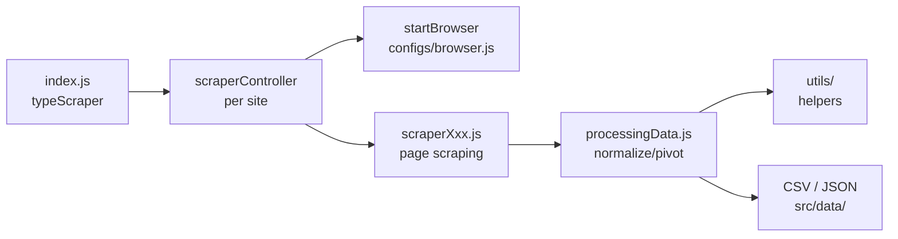

# Architecture

> **Last updated**: 2026-09-23

## Overview

A Node.js CLI scraper built on [Puppeteer](https://pptr.dev/). Each run
executes one site-specific scraper and writes results to timestamped CSV
files under [src/data](../src/data/). No framework, no database — plain
CommonJS modules orchestrated from [index.js](../index.js).

## High-level flow



## Directory layout

```
index.js                  Entry point — dispatches on TYPE_SCRAPER
src/
  configs/browser.js      Shared Puppeteer launch factory (headless Chromium)
  constants/
    commons.js            TYPE_SCRAPER enum (site selector)
    stocks.js             SCRAPER_TYPE_STOCKS enum + ticker lists per group
    batdongsan.js         Project slugs + listing pages to scrape
  data/                   Output: timestamped CSV exports, JSON snapshots
  scraper/<site>/         One folder per website
    scraperController.js  Orchestrates pages → scrape → process → export
    scraperXxx.js         Low-level Puppeteer page evaluation
    processingData.js     Transforms raw scrape output into exportable rows
  utils/
    commons.js            Shared helpers (e.g. removeUnit)
    <site>/commons.js     Site-specific helpers (URL builders, date parsers)
```

## Per-site scraper pattern

Every website follows the same three-layer structure:

1. **Controller** (`scraperController.js`) — loops over configured targets,
   opens/closes a browser per target, calls the scraper, writes output files.
2. **Scraper** (`scraperPrice.js`, `scraperFialda.js`, ...) — receives a
   `browser` instance and a URL, runs `page.evaluate` to extract raw DOM data.
3. **Processing** (`processingData.js`) — cleans units, resolves dates,
   shapes rows for CSV conversion via `json-2-csv`.

Site-specific constants (tickers, slugs, URLs, output paths) live in
[src/constants](../src/constants/commons.js), never hardcoded inside scrapers.

## Entry-point dispatch

[index.js](../index.js) uses a `switch` on `typeScraper` (a
`TYPE_SCRAPER` enum value) to invoke exactly one controller:

```js
let typeScraper = TYPE_SCRAPER.FIALDA;

switch (typeScraper) {
  case TYPE_SCRAPER.FIALDA:
    scraperFialda();
    break;
  // ...
}
```

## Variants

Some sites have multiple controllers:

- **Fialda**: [scraperController.js](../src/scraper/fialda/scraperController.js)
  exports one CSV per stock; [scraperControllerV2.js](../src/scraper/fialda/scraperControllerV2.js)
  pivots a whole stock group into a single CSV (rows = metrics, columns = symbols).
- **BatDongSan**: the controller writes both a raw JSON snapshot and a
  cleaned CSV per listing page.

## Key dependencies

| Package      | Purpose                                 |
| ------------ | --------------------------------------- |
| `puppeteer`  | Headless Chromium automation            |
| `json-2-csv` | JSON → CSV conversion for exports       |
| `moment`     | Date parsing/formatting in data cleanup |

## Conventions

- CommonJS (`require`/`module.exports`), 2-space indent, JSDoc file headers.
- One browser instance per scraped target; always `await browser.close()`.
- Output filenames include `new Date().getTime()` to avoid overwriting.
- The `"-N-"` entries in ticker lists are separator rows that render as
  empty CSV columns between industry groups.
